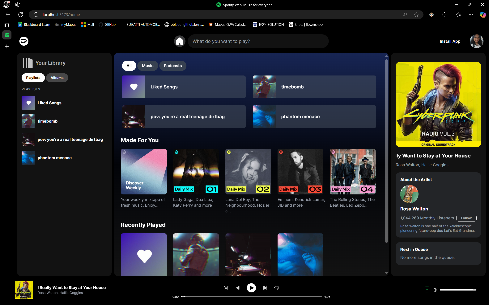
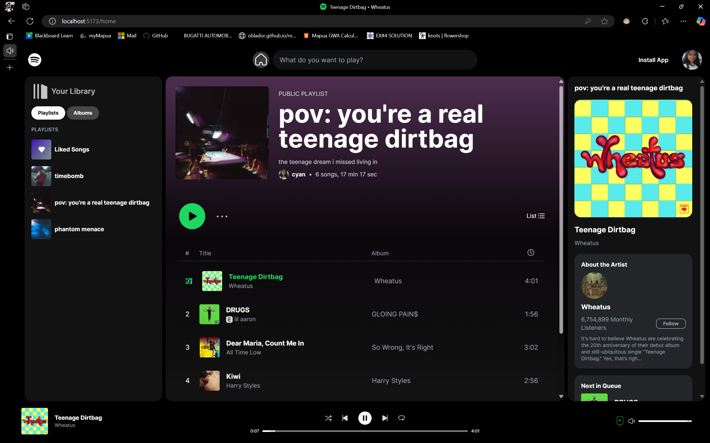

# Spotify UI Clone 🎵

This project is a **Spotify-inspired UI** created with modern tools and technologies, including **React (TypeScript)**, **TailwindCSS**, and **DaisyUI**. It features an elegant design and functionality to mimic Spotify's user interface.

| Home Preview                                    | Playlist and Playing Preview                     |
|------------------------------------------------|------------------------------------------------|
|  |  |

---

## Features ✨
- **Responsive Design**: Built with TailwindCSS and DaisyUI for seamless adaptability across devices.
- **Interactive UI**: Smooth interactions and animations for a delightful user experience.
- **Customizable**: Extendable for personal projects or learning purposes.
- **Full Spotify features**: With volume control and dynamic display.

---

## Tech Stack 🛠️
- **React (TypeScript)**: A popular JavaScript library for building user interfaces.
- **TailwindCSS**: A utility-first CSS framework for rapid UI development.
- **DaisyUI**: A TailwindCSS plugin providing accessible and customizable UI components.

---

## Installation Guide 💻

### Prerequisites
- Node.js (v16 or later)
- npm or yarn

### Steps to Install and Run
1. **Clone the Repository**:
   ```bash
   git clone https://github.com/masumizuu/spotify-ui.git
   cd spotify-ui
2. **Install Dependencies**: Install all required dependencies, including React, TailwindCSS, and DaisyUI.
   ```bash
   npm install
3. **Set Up TailwindCSS and DaisyUI**: TailwindCSS and DaisyUI are included in the project configuration. No additional setup is needed, but for reference:
   - [TailwindCSS: Installation Guide](https://tailwindcss.com/docs/installation)
   - [DaisyUI: Installation Guide](https://daisyui.com/docs/install/)
4. **Run the application**: Start the development server (e.g. if you're using JetBrains Webstorm)
   ```bash
   npm run dev
  Open your browser and visit [http://localhost:{port}] to view the project.

---

## Acknowledgments 🙏
- **Images**: Most images are sourced from the internet, specifically from Spotify, and others are my original work.
- **Credits**: All rights and credits go to their respective owners. This project is for educational purposes only and does not claim ownership over any third-party assets.

---

## Dev's Note 👩🏻
- Personally, there are minor tweaks and adjustments I can think of to adjust the bugs on this, it's just that I have gone over the bare minimum (in terms of the assignment requirements) so I'm leaving it at this. I worked on this *project* alone over the course of several, inconsecutive days so if you're going to use it as a reference, a credit would be appreciated! 💘
